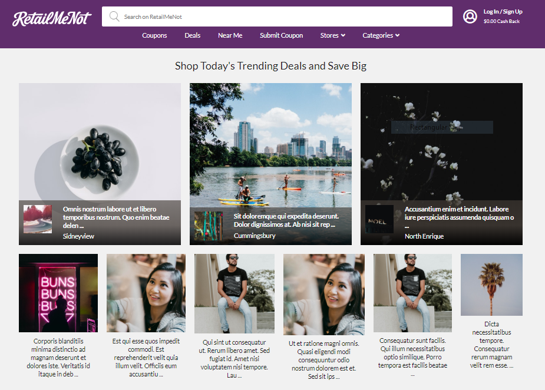

.

## Description:
This is the mockup website for "RetailMeNot.com" .
* Users can able to view coupons and buy through them.
* Users can like or unlike the coupons they are looking and using.
* Registered users can submit coupons and it will go to the review team.
* It will shop in the coupons if the coupon is accepted by the reviewer.

## Online App link:
* <a href="https://github.com/ilvcs" > RetailMeNot Mockup </a>

## Contributors:
 * <a href="https://github.com/ilvcs" >Thulasiram Peddiboina </a>
 * <a href="https://github.com/Anshul2166" >Anshul</a>
 * <a href="https://github.com/SandunWebDev" >Sandun</a>
 
## Technologies used :
React.js, Node.js, MongoDb, HTML, CSS.
 
## Copyright:
This just a mock-up MVC and this was created for educational purpose only.

